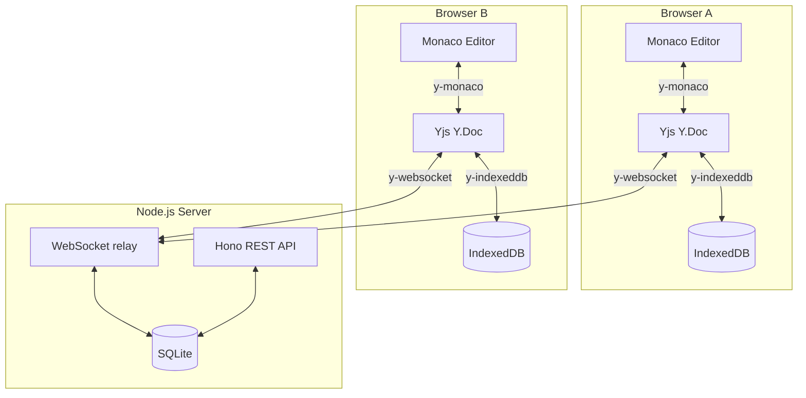

# Code Duo

> Real-time collaborative code editing, powered by CRDTs.

[](https://github.com/farhan-ahmed1/code-duo/actions/workflows/ci.yml)
[](https://codecov.io/gh/farhan-ahmed1/code-duo)

[](LICENSE)

<!-- Replace with:  once recorded -->

---

Multiple users open the same room URL and their keystrokes appear on each other's screens in milliseconds. No refresh. No conflicts. Edits survive a network drop and sync automatically when the connection comes back.

Built with **Yjs** (CRDT), **Monaco Editor** (the VS Code engine), **Next.js**, and a **Hono + WebSocket** backend.

---

## Features

| Feature                       | Description                                                                                                                                        |
| ----------------------------- | -------------------------------------------------------------------------------------------------------------------------------------------------- |
| **Zero-conflict editing**     | CRDTs mathematically guarantee that concurrent edits from any number of users always converge to the same document — no server arbitration needed. |
| **Live cursors & presence**   | See every connected user's cursor position and name in real time. Each user gets a unique colour.                                                  |
| **Offline-first**             | Keep editing with no connection. Changes persist locally via IndexedDB and merge automatically when the network returns.                           |
| **Synced language switching** | Changing the editor language in one tab updates syntax highlighting for every connected user instantly.                                            |
| **Persistent rooms**          | Documents survive server restarts. SQLite stores the full Yjs state as a compact binary blob.                                                      |
| **Connection status**         | Clear UI feedback for `connected`, `connecting`, and `disconnected` states.                                                                        |
| **Production-ready backend**  | Rate limiting, input validation, Prometheus metrics at `/metrics`, and structured Pino logging.                                                    |

---

## Tech stack

| Layer          | Technology                  | Why                                                                                                                |
| -------------- | --------------------------- | ------------------------------------------------------------------------------------------------------------------ |
| Frontend       | Next.js 14 (App Router)     | File-based routing and first-class TypeScript support                                                              |
| Code editor    | Monaco Editor               | The VS Code engine — familiar shortcuts, built-in language services for 20+ languages                              |
| CRDT library   | Yjs                         | Mature ecosystem (`y-websocket`, `y-indexeddb`, `y-monaco`) with the lowest overhead for sequential-text use cases |
| WebSocket sync | y-websocket                 | First-party Yjs provider with built-in reconnection and exponential backoff                                        |
| Offline sync   | y-indexeddb                 | Mirrors the document to IndexedDB so the editor is interactive before the WebSocket connects                       |
| HTTP framework | Hono                        | Lightweight and fully typed; WebSocket server shares the same `http.Server`                                        |
| Database       | SQLite via better-sqlite3   | Zero-configuration — the entire database is a single file in a Docker volume                                       |
| Monorepo       | Turborepo + pnpm workspaces | Shared `tsconfig`, unified scripts, fast incremental builds                                                        |

---

## Run it locally

```bash
pnpm install
pnpm dev
```

Frontend → [http://localhost:3000] · Backend → [http://localhost:4000]

Or run the full production stack with Docker:

```bash
docker compose up
```

---

## Architecture overview



A keystroke in Browser A is converted by `y-monaco` into a Yjs update — a binary-encoded operation tagged with a unique `clientID + clock`. The server relays it to every other client. Each client applies it locally; no server-side merge logic exists. If Browser B was offline and made concurrent edits, Yjs's CRDT merges both sets of operations deterministically when the connection is restored.

---

## Testing

```bash
# Unit tests (all packages)
pnpm test:unit

# E2E tests (Chromium — starts dev servers automatically)
pnpm test:e2e

# Cross-browser E2E (Chromium + Firefox + WebKit)
pnpm test:e2e:cross-browser

# Stress tests (5+ concurrent users, network interruptions)
pnpm test:e2e:stress

# Performance benchmarks (edit latency & document load time)
pnpm test:e2e:benchmark
```

---

## Deploy

### Automated Deploys via GitHub Actions

The repo now includes [.github/workflows/deploy.yml](.github/workflows/deploy.yml), which reuses the CI workflow and then deploys:

| Target       | Platform         | Trigger                    |
| ------------ | ---------------- | -------------------------- |
| `production` | Railway + Vercel | Push to `main`             |
| `staging`    | Railway + Vercel | Manual `workflow_dispatch` |

The workflow expects two GitHub Environments named `staging` and `production`. Each environment must define these secrets:

| Secret              | Purpose                                    |
| ------------------- | ------------------------------------------ |
| `RAILWAY_TOKEN`     | Railway project token used by `railway up` |
| `VERCEL_TOKEN`      | Vercel access token for CLI deploys        |
| `VERCEL_ORG_ID`     | Vercel org/team id                         |
| `VERCEL_PROJECT_ID` | Vercel project id for `apps/web`           |

Each GitHub Environment must also define these variables:

| Variable             | Example                                  | Purpose                                                        |
| -------------------- | ---------------------------------------- | -------------------------------------------------------------- |
| `RAILWAY_SERVICE`    | `server`                                 | Railway service name or id to deploy                           |
| `RAILWAY_PUBLIC_URL` | `https://code-duo-server.up.railway.app` | Public backend base URL used for health checks and smoke tests |

The workflow verifies the deployment in three stages:

1. It re-runs CI through the reusable [ci.yml](.github/workflows/ci.yml) workflow.
2. It deploys the Railway backend, waits for `/api/health` to report `healthy`, then deploys the Vercel frontend.
3. It runs a Chromium Playwright smoke test against the live Vercel URL and Railway API to confirm room creation and live collaboration still work after deploy.

### Backend → Railway

The repo includes a `railway.toml` that builds from the server Dockerfile. Create a new Railway project, link the repo, and set these environment variables:

| Variable   | Value        |
| ---------- | ------------ |
| `PORT`     | `4000`       |
| `DATA_DIR` | `/app/data`  |
| `NODE_ENV` | `production` |

Railway provisions a persistent volume automatically when `DATA_DIR` is used. The health check at `/api/health` verifies the deploy.

### Frontend → Vercel

Import the repo into Vercel. The `vercel.json` in the root configures the build. Set these environment variables in the Vercel dashboard:

| Variable              | Value                           |
| --------------------- | ------------------------------- |
| `NEXT_PUBLIC_WS_URL`  | `wss://<your-railway-domain>`   |
| `NEXT_PUBLIC_API_URL` | `https://<your-railway-domain>` |

After deploying both, verify:

1. Open your Vercel URL → create a room
2. Copy the room link → open in a second device/browser
3. Type in one tab → edits appear in the other

If you want GitHub Actions to own deploys completely, mirror the same Vercel and Railway environment configuration in both `staging` and `production` before enabling the workflow.

---

## Docs

- [Architecture](docs/architecture.md) — data flow, concurrency model, persistence, scaling considerations, and technology decisions
- [Architecture Decision Records](docs/adrs/README.md) — formal decisions with context, alternatives, rationale, and accepted trade-offs
- [CRDT Explainer](docs/crdt-explainer.md) — how Yjs works internally, CRDTs vs. OT, and common interview questions
- [API Reference](docs/API.md) — REST endpoints, WebSocket protocol, and error codes

---
