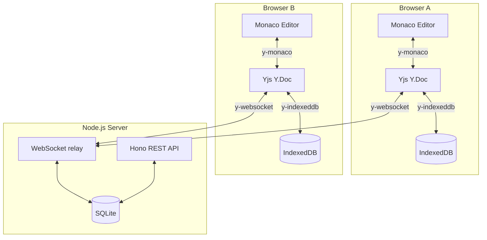

# Code Duo

> Real-time collaborative code editing, powered by CRDTs.


<!-- Replace with:  once recorded -->

---

Multiple users open the same room URL and their keystrokes appear on each other's screens in milliseconds. No refresh. No conflicts. Edits survive a network drop and sync automatically when the connection comes back.

Built with **Yjs** (CRDT), **Monaco Editor** (the VS Code engine), **Next.js**, and a **Hono + WebSocket** backend.

---

## Features

| Feature                       | Description                                                                                                                                        |
| ----------------------------- | -------------------------------------------------------------------------------------------------------------------------------------------------- |
| **Zero-conflict editing**     | CRDTs mathematically guarantee that concurrent edits from any number of users always converge to the same document — no server arbitration needed. |
| **Live cursors & presence**   | See every connected user's cursor position and name in real time. Each user gets a unique colour.                                                  |
| **Offline-first**             | Keep editing with no connection. Changes persist locally via IndexedDB and merge automatically when the network returns.                           |
| **Synced language switching** | Changing the editor language in one tab updates syntax highlighting for every connected user instantly.                                            |
| **Persistent rooms**          | Documents survive server restarts. SQLite stores the full Yjs state as a compact binary blob.                                                      |
| **Connection status**         | Clear UI feedback for `connected`, `connecting`, and `disconnected` states.                                                                        |
| **Production-ready backend**  | Rate limiting, input validation, Prometheus metrics at `/metrics`, and structured Pino logging.                                                    |

---

## Tech stack

| Layer          | Technology                  | Why                                                                                                                |
| -------------- | --------------------------- | ------------------------------------------------------------------------------------------------------------------ |
| Frontend       | Next.js 14 (App Router)     | File-based routing and first-class TypeScript support                                                              |
| Code editor    | Monaco Editor               | The VS Code engine — familiar shortcuts, built-in language services for 20+ languages                              |
| CRDT library   | Yjs                         | Mature ecosystem (`y-websocket`, `y-indexeddb`, `y-monaco`) with the lowest overhead for sequential-text use cases |
| WebSocket sync | y-websocket                 | First-party Yjs provider with built-in reconnection and exponential backoff                                        |
| Offline sync   | y-indexeddb                 | Mirrors the document to IndexedDB so the editor is interactive before the WebSocket connects                       |
| HTTP framework | Hono                        | Lightweight and fully typed; WebSocket server shares the same `http.Server`                                        |
| Database       | SQLite via better-sqlite3   | Zero-configuration — the entire database is a single file in a Docker volume                                       |
| Monorepo       | Turborepo + pnpm workspaces | Shared `tsconfig`, unified scripts, fast incremental builds                                                        |

---

## Run it locally

```bash
pnpm install
pnpm dev
```

Frontend → [http://localhost:3000] · Backend → [http://localhost:4000]

Or run the full production stack with Docker:

```bash
docker compose up
```

---

## Architecture overview



A keystroke in Browser A is converted by `y-monaco` into a Yjs update — a binary-encoded operation tagged with a unique `clientID + clock`. The server relays it to every other client. Each client applies it locally; no server-side merge logic exists. If Browser B was offline and made concurrent edits, Yjs's CRDT merges both sets of operations deterministically when the connection is restored.

---

## Docs

- [Architecture](docs/architecture.md) — data flow, concurrency model, persistence, scaling considerations, and technology decisions
- [CRDT Explainer](docs/crdt-explainer.md) — how Yjs works internally, CRDTs vs. OT, and common interview questions
- [API Reference](docs/api.md) — REST endpoints, WebSocket protocol, and error codes

---
