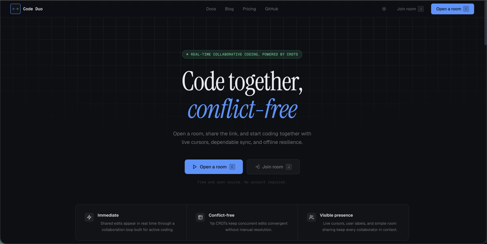
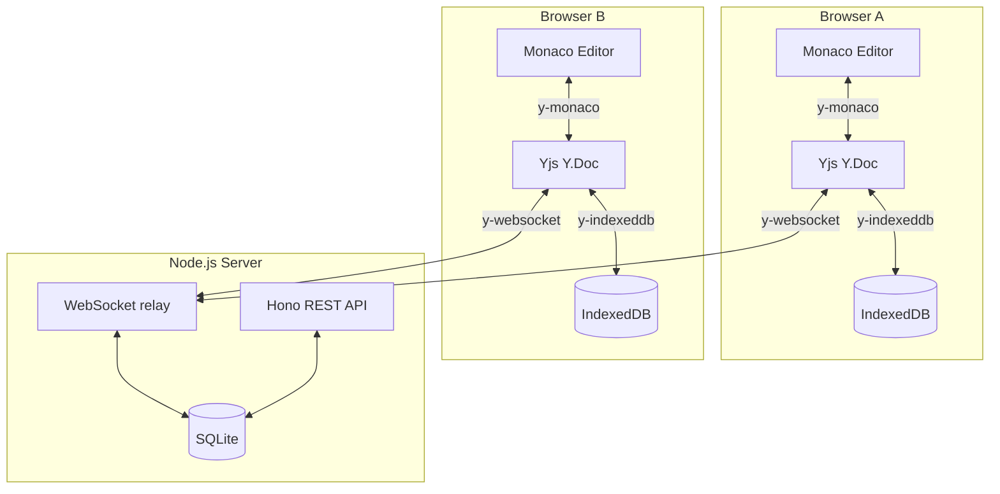

# Code Duo

> Code together, conflict-free.

[](https://github.com/farhan-ahmed1/code-duo/actions/workflows/ci.yml)
[](https://codecov.io/gh/farhan-ahmed1/code-duo)

[](LICENSE)

Real-time collaborative coding for serious software work. Open a room, share the link, and start editing together instantly with live cursors, synced language settings, offline resilience, and CRDT-backed convergence.



Code Duo is a browser-first collaborative code editor built as a polished portfolio project and product MVP. It combines a fast developer workflow with production-minded engineering: Yjs-powered conflict-free editing, Monaco Editor, a typed Hono API, persistent SQLite room state, WebSocket sync, metrics, logging, and deployment automation.

## Why It Matters

- Open a room in seconds instead of coordinating local editor plugins or heavyweight cloud IDE setup.
- Keep multiple collaborators in the same document without server-side merge arbitration.
- Recover cleanly from network interruptions with IndexedDB-backed offline state.
- Demonstrate product thinking, engineering rigor, and deployment readiness in one repository.

## Feature Highlights

| Area                | What ships today                                                                                        |
| ------------------- | ------------------------------------------------------------------------------------------------------- |
| Real-time editing   | Concurrent edits converge through Yjs CRDTs with no merge-conflict drama during live collaboration      |
| Presence            | Live cursors, participant names, and room awareness update in real time                                 |
| Developer workflow  | Monaco-powered editing, shared language switching, keyboard shortcuts, and responsive presence UI       |
| Resilience          | Local IndexedDB cache keeps documents interactive during disconnects and re-syncs automatically         |
| Persistence         | Room metadata and Yjs snapshots are stored in SQLite so sessions survive server restarts                |
| Operational quality | Rate limiting, validation, structured logging, health checks, Prometheus metrics, and CI/CD deploy flow |

## Stack

| Layer               | Technology                              | Role                                                         |
| ------------------- | --------------------------------------- | ------------------------------------------------------------ |
| Web app             | Next.js 16 + React 18 + Tailwind        | Browser-first product UI and room flows                      |
| Editor              | Monaco Editor                           | Familiar VS Code-grade editing experience                    |
| Collaboration       | Yjs, y-websocket, y-indexeddb, y-monaco | Conflict-free sync, transport, offline cache, editor binding |
| API and sync server | Hono + ws                               | REST endpoints, health checks, metrics, and WebSocket relay  |
| Persistence         | SQLite via better-sqlite3               | Room metadata and document snapshot storage                  |
| Monorepo tooling    | pnpm workspaces + Turborepo             | Shared scripts, packages, and incremental tasks              |
| Hosting             | Railway + Vercel                        | Backend and frontend deployment targets                      |

## Quickstart

### Prerequisites

- Node.js 20+
- pnpm 9+
- Docker Desktop optional, for containerized local runs

### Local development

The web app defaults to `http://localhost:4000` and `ws://localhost:4000`, so a fresh clone works without extra environment setup.

```bash
pnpm install
pnpm dev
```

Apps:

- Frontend: `http://localhost:3000`
- Backend: `http://localhost:4000`
- Backend health check: `http://localhost:4000/api/health`
- Prometheus metrics: `http://localhost:4000/metrics`

### Quick verification

1. Open `http://localhost:3000`.
2. Create a room.
3. Open the same room URL in a second tab or browser.
4. Type in one editor and confirm the other updates in real time.

### Run with Docker

```bash
docker compose up --build
```

This starts:

- `web` on port `3000`
- `server` on port `4000`
- A persistent Docker volume for SQLite-backed room data

## Testing

### Core quality gates

```bash
pnpm lint
pnpm build
pnpm test:unit
```

### End-to-end coverage

```bash
# Default browser matrix
pnpm test:e2e

# Explicit cross-browser run from the web app package
pnpm test:e2e:cross-browser

# Opt-in suites
pnpm test:e2e:stress
pnpm test:e2e:benchmark
```

### Package-specific commands

```bash
pnpm --filter @code-duo/server test:unit
pnpm --filter @code-duo/web test:unit
pnpm --filter @code-duo/server test:ws
```

## Deployment

### Production shape

- Frontend deploys to Vercel.
- Backend deploys to Railway.
- GitHub Actions gates deploys through CI before promoting changes.

### GitHub Actions deploy flow

The repository includes `.github/workflows/deploy.yml` for staged deploy automation.

| Environment  | Platform         | Trigger                    |
| ------------ | ---------------- | -------------------------- |
| `production` | Railway + Vercel | Push to `main`             |
| `staging`    | Railway + Vercel | Manual `workflow_dispatch` |

Required GitHub environment secrets:

- `RAILWAY_TOKEN`
- `VERCEL_TOKEN`
- `VERCEL_ORG_ID`
- `VERCEL_PROJECT_ID`

Optional GitHub environment secrets:

- `VERCEL_AUTOMATION_BYPASS_SECRET` if Vercel Deployment Protection is enabled. The deploy workflow uses it for the root probe and deployed Playwright smoke test.

Required GitHub environment variables:

- `RAILWAY_SERVICE`
- `RAILWAY_PUBLIC_URL`

The workflow:

1. Re-runs CI via the shared workflow.
2. Deploys the Railway backend and waits for `/api/health` to report healthy.
3. Deploys the Vercel frontend.
4. Runs a deployed Playwright smoke test to confirm room creation and collaboration still work.

### Railway backend

The backend uses `railway.toml` plus the server Dockerfile. Configure these values in Railway:

| Variable   | Value        |
| ---------- | ------------ |
| `PORT`     | `4000`       |
| `DATA_DIR` | `/app/data`  |
| `NODE_ENV` | `production` |

### Vercel frontend

Configure these environment variables in Vercel:

| Variable               | Value                            |
| ---------------------- | -------------------------------- |
| `NEXT_PUBLIC_BASE_URL` | `https://<your-frontend-domain>` |
| `NEXT_PUBLIC_WS_URL`   | `wss://<your-railway-domain>`    |
| `NEXT_PUBLIC_API_URL`  | `https://<your-railway-domain>`  |

`NEXT_PUBLIC_BASE_URL` keeps Open Graph and Twitter metadata pinned to the real deployed frontend origin. On Vercel, the app also falls back to the platform deployment URL automatically, but setting it explicitly avoids localhost metadata leaks on non-standard builds.

## Architecture At A Glance



Code Duo treats collaboration as a product reliability problem, not just a transport problem. Browser clients edit local Yjs documents, sync through WebSockets, persist local state in IndexedDB, and hydrate durable room state from SQLite-backed snapshots on the server.

## Repository Layout

```text
apps/
  server/   Hono API, WebSocket relay, persistence, metrics, tests
  web/      Next.js product UI, landing page, room experience, Playwright
packages/
  shared/   Shared types, constants, and cross-package utilities
docs/       Architecture, API, ADRs, UX, and product documentation
agency/     Planning, strategy, sprint, and brand artifacts
```

## Supporting Docs

- [docs/architecture.md](docs/architecture.md) for system design, persistence, scaling, and request flow
- [docs/API.md](docs/API.md) for REST endpoints, health checks, metrics, and protocol details
- [docs/crdt-explainer.md](docs/crdt-explainer.md) for the Yjs model and CRDT background
- [docs/adrs/README.md](docs/adrs/README.md) for architecture decisions and trade-offs
- [docs/ux-architecture.md](docs/ux-architecture.md) for product UX structure and interaction direction
- [agency/07-BRAND-IDENTITY-SYSTEM.md](agency/07-BRAND-IDENTITY-SYSTEM.md) for positioning, messaging, and visual system

## Contributing

Contributions are welcome if they keep the product precise, reliable, and developer-native.

1. Read [CONTRIBUTING.md](CONTRIBUTING.md) before opening a pull request.
2. Keep changes scoped and document any product or architecture trade-offs.
3. Run the relevant lint, build, unit, and end-to-end checks before submitting.
4. Update docs when behavior, API shape, UX copy, or deployment flow changes.

## License

Released under the [MIT License](LICENSE).
