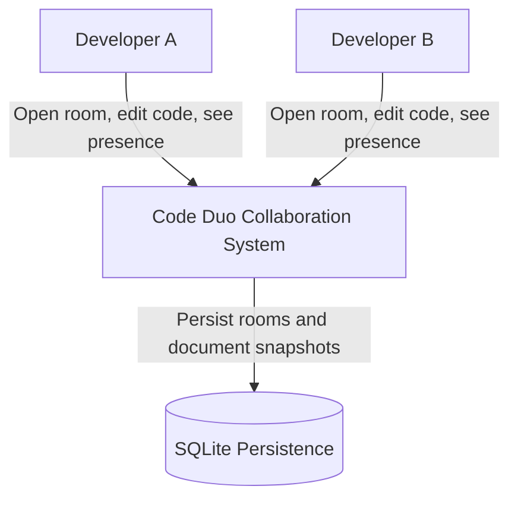
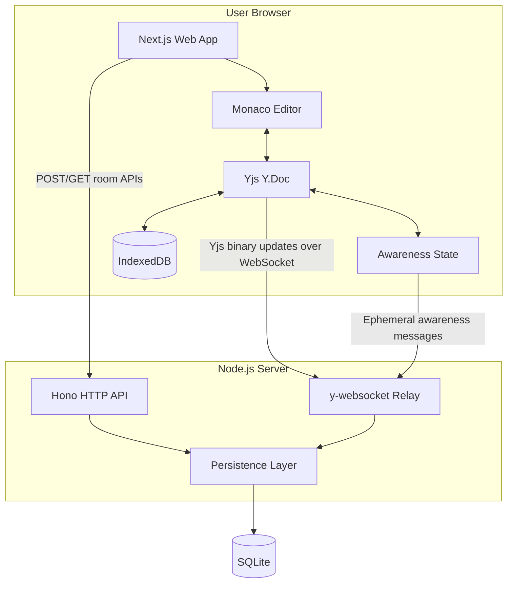
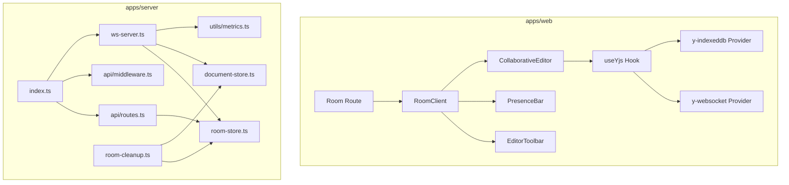
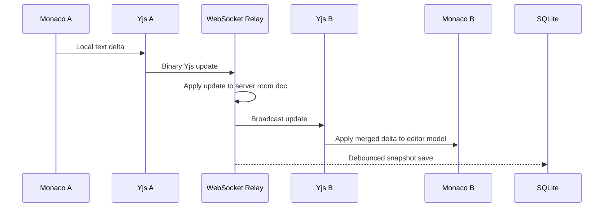

# System Design

## Delivery Status

- ✅ Formal ADR set completed in [docs/adrs](./adrs/README.md)
- ✅ C4 model documented at context, container, and component levels
- ✅ End-to-end keystroke to screen flow documented
- ✅ Scaling analysis added for MVP, 1K rooms, and 10K rooms
- ✅ Failure modes documented for server crash, network partition, and browser crash
- ✅ Trade-off analysis added for transport, persistence, and rendering strategy

## Scope

Code Duo is a real-time collaborative code editor built around CRDT synchronization. The current implementation uses a Next.js web app, Monaco Editor, Yjs, `y-websocket`, a Hono-based API server, and SQLite via `better-sqlite3`.

Primary constraints:

- Collaborative text must converge without server-side conflict resolution.
- The editor must remain usable during temporary disconnection.
- MVP scale target is 10+ concurrent users per room and 100+ rooms.
- Persistence must store room metadata and recover document state after process restart.

## ADR Map

- [ADR-001](./adrs/ADR-001-crdts-over-ot.md) — CRDTs over OT
- [ADR-002](./adrs/ADR-002-yjs-over-automerge.md) — Yjs over Automerge
- [ADR-003](./adrs/ADR-003-monaco-over-codemirror.md) — Monaco over CodeMirror
- [ADR-004](./adrs/ADR-004-sqlite-over-postgresql-for-mvp.md) — SQLite over PostgreSQL for MVP
- [ADR-005](./adrs/ADR-005-hono-over-express-fastify.md) — Hono over Express and Fastify
- [ADR-006](./adrs/ADR-006-monorepo-with-pnpm-and-turborepo.md) — pnpm + Turborepo monorepo
- [ADR-007](./adrs/ADR-007-ephemeral-awareness-protocol.md) — Ephemeral awareness protocol

## C4 Model

### Level 1: System Context

System responsibilities:

- Accept room creation and room lookup requests.
- Synchronize shared Yjs document updates across connected browsers.
- Provide transient awareness for presence and cursor identity.
- Persist room metadata and serialized Yjs state for recovery.

### Level 2: Container View

Container responsibilities:

| Container | Responsibility |
| --- | --- |
| Next.js web app | Routes users, renders room shell, creates collaborative editor session |
| Monaco Editor | Local editing surface, language modes, cursor model |
| Yjs document | Shared text state, merge semantics, update encoding |
| IndexedDB | Local cache for offline-first recovery and warm reloads |
| Hono API | Room CRUD, health endpoints, metrics exposure, middleware |
| y-websocket relay | Fan-out for Yjs updates and awareness payloads |
| SQLite persistence | Durable room metadata and encoded document snapshots |

### Level 3: Component View

Key component boundaries:

- `useYjs` owns shared document initialization, provider wiring, and offline cache bootstrap.
- `CollaborativeEditor` binds Monaco to the shared `Y.Text` instance.
- `ws-server.ts` owns connection lifecycle, room connection counts, persistence hooks, and message instrumentation.
- `room-store.ts` and `document-store.ts` isolate SQLite access so persistence decisions remain swappable.

## Data Flow: Keystroke to Screen

This is the complete path from a local keystroke to remote screen convergence.

1. A user types in Monaco inside the browser.
2. The Monaco binding converts the local model delta into a mutation on a shared `Y.Text`.
3. Yjs emits a binary update representing the operation with client-specific causal metadata.
4. The `y-websocket` provider sends that binary update to the room WebSocket endpoint.
5. The server relay applies the update to the room's in-memory `Y.Doc` and broadcasts it to the other connected clients for that room.
6. Each receiving client applies the update to its own local `Y.Doc`.
7. The local Monaco binding observes the Yjs change and patches the remote editor model.
8. Presence state updates separately through the awareness channel so cursor and participant UI remain live.
9. On a debounce window, the server serializes the current `Y.Doc` with `Y.encodeStateAsUpdate` and stores it in SQLite.
10. In parallel, each client persists updates into IndexedDB so reconnect and reload are fast even before the server sync completes.

## Persistence and Offline Model

Durable state and transient state are intentionally separated.

| State type | Storage | Why |
| --- | --- | --- |
| Document content | SQLite and IndexedDB | Durable recovery plus fast local warm start |
| Room metadata | SQLite | Needed for room lifecycle, API responses, and cleanup |
| Awareness and cursors | Memory only | Ephemeral collaboration state should not survive reconnect |

Design implications:

- The server is not a conflict resolver. It only relays and snapshots.
- IndexedDB makes the editor locally responsive before the WebSocket handshake finishes.
- SQLite is the durability boundary for MVP disaster recovery, not the primary collaboration engine.

## Scaling Analysis

### MVP Envelope: 100 Rooms

Current architecture is appropriate for the validated MVP scope.

- Single Node.js process handles API and WebSocket traffic.
- SQLite in WAL mode supports the current write pattern of debounced document snapshots.
- In-memory room connection tracking is operationally simple and matches single-instance deployment.

### At 1K Rooms

Primary bottlenecks shift from product correctness to resource coordination.

| Concern | Current behavior | Change required |
| --- | --- | --- |
| WebSocket fan-out | One process handles all room broadcasts | Add horizontal relay scale with Redis-backed pub/sub or room sharding |
| Room state memory | Hot rooms keep server-side Yjs docs in process memory | Add eviction policy and lazy reload strategy |
| SQLite write pressure | Snapshot writes serialize through one file | Introduce write queue discipline or move persistence to PostgreSQL |
| Rate limiting | Per-process counters only | Move rate limits to shared infrastructure such as Redis |

Recommended architecture delta at 1K rooms:

- Split HTTP and WebSocket responsibilities if relay traffic becomes dominant.
- Introduce shared coordination for fan-out and rate limiting.
- Keep document snapshots as snapshots, not append-only event history, to control recovery cost.

### At 10K Rooms

The MVP topology stops being the right shape.

| Concern | Why it breaks | New architecture direction |
| --- | --- | --- |
| Single-node relay | CPU and socket fan-out become operational risk | Multi-instance WebSocket tier with room partitioning |
| Single SQLite file | No practical multi-node durability or failover story | PostgreSQL or object storage plus queue-backed snapshot workers |
| Regional latency | One region hurts edit latency globally | Region-aware routing with colocated relay nodes |
| Hot-room concentration | Large rooms can dominate one process | Consistent-hash room assignment and explicit load shedding |

Recommended architecture delta at 10K rooms:

- Separate API, relay, and persistence concerns into independently scalable services.
- Use shared pub/sub or CRDT-aware relay coordination across instances.
- Introduce observability for per-room latency, memory usage, and reconnect churn before reaching this scale.

## Failure Modes

| Failure mode | Expected behavior | User impact | Mitigation |
| --- | --- | --- | --- |
| Server crash | Active sockets drop; clients enter reconnect loop; unsaved server memory is lost | Recent unsnapshotted server state may be lost, but locally cached browser state remains | Debounced snapshots, IndexedDB recovery, process restart, health probes |
| Network partition | Browser continues applying edits locally; provider retries connection | Remote collaborators stop seeing changes until partition heals | Yjs convergence on reconnect, connection status UI, offline cache |
| Browser crash or tab close | Local session disappears; awareness state vanishes; unsent local updates may remain only in IndexedDB | Presence drops immediately; user may lose only edits not yet committed to local storage | IndexedDB persistence, reconnect bootstrap, awareness treated as ephemeral |

Operational notes:

- Presence accuracy intentionally degrades before document correctness does.
- The strongest recovery path is browser-local state plus later convergence, not server-central authority.
- Alerting should distinguish API readiness, WebSocket accept rate, and snapshot failure rate.

## Trade-off Analysis

### WebSocket vs WebRTC vs SSE

| Option | Strengths | Weaknesses | Fit for Code Duo |
| --- | --- | --- | --- |
| WebSocket | Full-duplex, widely supported, natural fit for room relay model | Requires stateful connection infrastructure | ✅ Best MVP fit |
| WebRTC | Peer-to-peer potential, lower server relay cost in some topologies | NAT traversal complexity, harder room coordination, weaker operational predictability | Better for later experiments than MVP default |
| SSE | Simpler server push for one-way streams | No client-to-server duplex channel, poor fit for collaborative editing | Not suitable |

Decision:

Use WebSocket for collaborative transport because Code Duo needs bidirectional low-latency updates and awareness signaling. WebRTC is attractive only if relay cost dominates later, and SSE does not satisfy the duplex requirement.

### SQLite vs PostgreSQL vs LevelDB

| Option | Strengths | Weaknesses | Fit for Code Duo |
| --- | --- | --- | --- |
| SQLite | Minimal ops, fast local file access, enough for single-node MVP | Single-writer ceiling, weak multi-node story | ✅ Best MVP fit |
| PostgreSQL | Concurrency, observability, HA options, easier multi-node future | More operational overhead than needed now | Best next step after MVP scale |
| LevelDB | Fast embedded key-value storage | Poor fit for relational room metadata and operational introspection | Too low-level for current needs |

Decision:

Use SQLite for MVP because the schema is small and deployment simplicity matters more than early distributed durability. PostgreSQL is the expected upgrade once relay scale or multi-instance persistence becomes necessary.

### Server-Side Rendering vs Client-Only for Editor Page

| Option | Strengths | Weaknesses | Fit for Code Duo |
| --- | --- | --- | --- |
| Full SSR editor page | Faster first paint for static shell, SEO-friendly surrounding page | Monaco and collaboration providers are browser-centric and need hydration workarounds | Useful for shell, not for editor core |
| Client-only page | Simplifies browser-only editor code | Worse perceived loading and weaker metadata/SEO story | Too blunt for full app |
| Hybrid SSR shell + client-only editor | SSR handles page frame and metadata; editor loads dynamically in browser | Requires explicit boundaries between server and client components | ✅ Best fit |

Decision:

Use a hybrid model. Render the room shell through Next.js, but load Monaco and live collaboration logic on the client. This preserves route-level UX and metadata while respecting Monaco's browser-only runtime.

## Recommended Next Architectural Steps

1. Add an ADR for multi-instance relay coordination before introducing Redis or room sharding.
2. Define snapshot compaction and restore SLAs before moving beyond SQLite.
3. Add room-level latency and reconnect metrics so scaling decisions are based on observed load rather than aggregate traffic alone.
