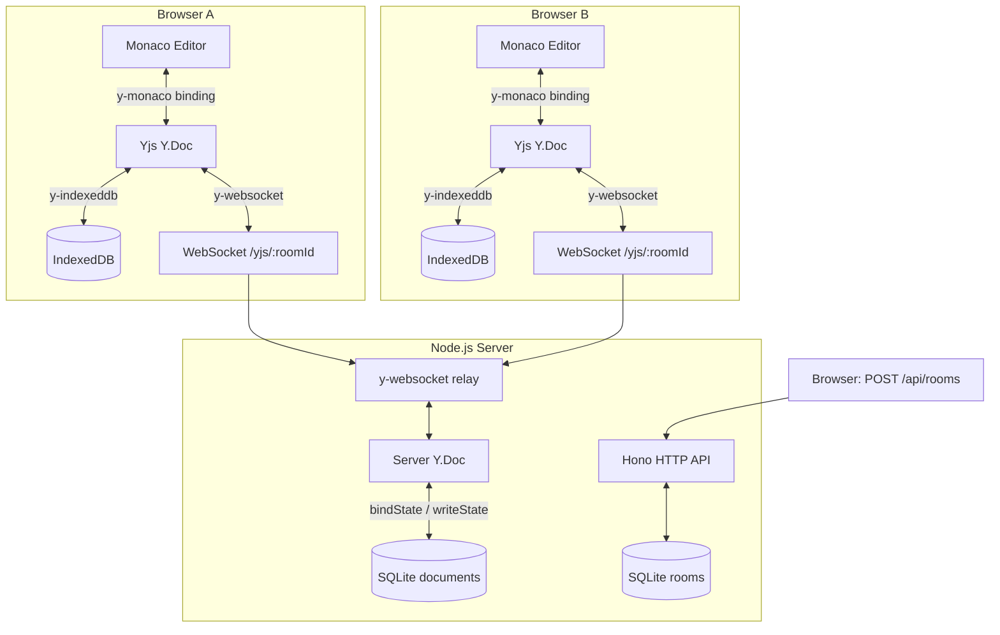
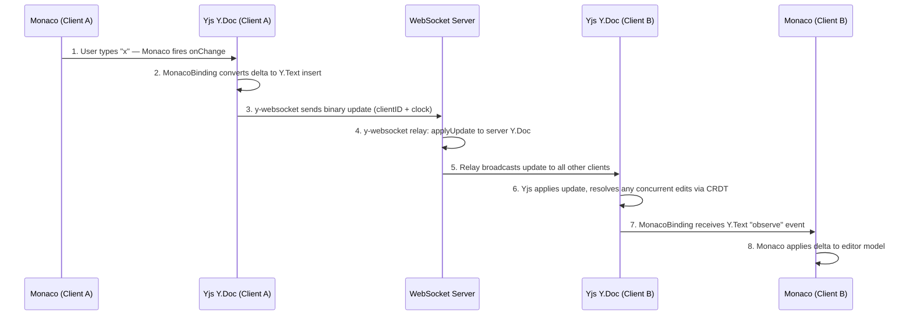

# Architecture

## Overview

Code Duo is a real-time collaborative code editor. Two people open the same room URL and their keystrokes appear on each other's screens within milliseconds — no refresh, no conflicts, no data loss if the network drops. This document explains how that works end-to-end.

The system has three major layers:

1. **Frontend** — Next.js + Monaco Editor, with Yjs running entirely in the browser.
2. **Backend** — a single Node.js process that relays Yjs updates over WebSocket and persists document state to SQLite.
3. **Persistence** — two tiers: SQLite on the server for durability, IndexedDB in the browser for offline speed.



## Components

### Frontend (`apps/web`)

Built with **Next.js 14** (App Router) and **React 18**.

| Component                  | Role                                                                                                                       |
| -------------------------- | -------------------------------------------------------------------------------------------------------------------------- |
| `CollaborativeEditor`      | Mounts Monaco; creates the `MonacoBinding` between Monaco and Yjs                                                          |
| `y-websocket` provider     | Opens a WebSocket to the server and syncs the `Y.Doc`                                                                      |
| `y-indexeddb` provider     | Mirrors the `Y.Doc` in the browser's IndexedDB for offline support                                                         |
| `useYjs` hook              | Initialises the `Y.Doc`, both providers, and exposes the shared `Y.Text` and `Y.Map`                                       |
| `useConnectionStatus` hook | Subscribes to `WebsocketProvider` events and exposes `connected / connecting / disconnected` plus `synced / syncing` state |
| `useAwareness` hook        | Reads the awareness state from the `WebsocketProvider` to drive the presence bar                                           |
| `PresenceBar`              | Renders a live list of connected users with their colors and cursor names                                                  |
| `EditorToolbar`            | Language picker (synced via a shared `Y.Map`), theme toggle, connection status indicator                                   |

The text content lives in a `Y.Text` instance keyed as `"monaco"`. Room settings (language, theme) live in a `Y.Map` keyed as `"settings"`. Both are properties of the same `Y.Doc`, so they sync through the same WebSocket connection.

### Backend (`apps/server`)

A single **Node.js** HTTP server that handles both the REST API and WebSocket connections.

```bash
index.ts          — binds HTTP server, attaches WebSocket upgrade handler
api/
  routes.ts       — Hono router: POST /api/rooms, GET /api/rooms, health, metrics
  middleware.ts   — CORS, request logger, Prometheus histogram, error handler
  rate-limiter.ts — in-memory sliding-window rate limiter
  validation.ts   — input sanitisation, body-size limit
ws-server.ts      — y-websocket relay, persistence hooks, metrics instrumentation
jobs/
  room-cleanup.ts — background job: delete rooms idle for 7+ days
persistence/
  room-store.ts   — SQLite CRUD for room metadata
  document-store.ts — SQLite save/load for Yjs binary state
utils/
  metrics.ts      — prom-client gauges, counters, histograms
  logger.ts       — Pino structured logger
  id.ts           — nanoid-based room ID generator
```

The Hono app and the `WebSocketServer` (from the `ws` package) share the same underlying Node.js `http.Server`. HTTP requests go to Hono; WebSocket upgrade requests for paths starting with `/yjs/` are handed off to `ws`.

### Persistence (`SQLite via better-sqlite3`)

Two tables:

```sql
-- Room metadata
CREATE TABLE rooms (
  id          TEXT PRIMARY KEY,   -- URL-safe nanoid, 8 chars
  name        TEXT NOT NULL,
  language    TEXT NOT NULL DEFAULT 'typescript',
  created_at  TEXT NOT NULL,
  updated_at  TEXT NOT NULL,
  accessed_at TEXT NOT NULL       -- updated on every WS connection
);

-- Yjs document state (binary)
CREATE TABLE documents (
  room_id    TEXT PRIMARY KEY,
  state      BLOB NOT NULL,       -- Y.encodeStateAsUpdate output
  updated_at TEXT NOT NULL
);
```

Both databases run in **WAL mode** (`PRAGMA journal_mode = WAL`) so reads do not block writes.

## Data Flow: Keystroke to Screen

Here is exactly what happens when a user types a character:



The whole path, on a local network, takes roughly 50–150 ms end-to-end (see [Performance Benchmarks](#performance-benchmarks)). Step 6 is where the CRDT does its work — if Client B also typed something at the same position while offline, Yjs merges both operations deterministically without asking the server. See [CRDT-EXPLAINER.md](crdt-explainer.md) for a deep dive on how that works.

## Concurrency Model

Code Duo has **no server-side conflict resolution logic**. The server is a relay — it forwards binary Yjs updates between clients and keeps a copy of the latest document state. All conflict resolution happens inside the Yjs CRDT implementation running in each browser.

This is fundamentally different from services like Google Docs (which use Operational Transformation and require a central authority to impose operation order). With CRDTs:

- Each operation carries a globally unique identifier `(clientID, clock)`.
- Operations are **idempotent**: applying the same update twice produces the same result.
- Operations are **commutative**: `apply(A, B)` = `apply(B, A)` regardless of arrival order.
- Operations are **associative**: merging in any grouping yields the same result.

These three properties together mean clients can receive updates in any order, apply them to their local state, and always converge to the same document — with zero coordination from the server.

Concurrent inserts at the exact same position are resolved by a deterministic tiebreaker in **YATA** (Yjs's algorithm), based on the clientID values. The same tiebreaker runs identically on every client, so all clients agree on the final order.

## Persistence Strategy

Document state is saved in two places:

### Server-side (SQLite)

The persistence lifecycle is managed by `y-websocket`'s `setPersistence` hooks:

| Hook                         | When it fires                   | What it does                                                                                 |
| ---------------------------- | ------------------------------- | -------------------------------------------------------------------------------------------- |
| `bindState`                  | First client connects to a room | Loads the saved `BLOB` from `documents` table and calls `Y.applyUpdate` on the fresh `Y.Doc` |
| `writeState` (final flush)   | Last client disconnects         | Encodes the full document state with `Y.encodeStateAsUpdate` and saves to SQLite immediately |
| Incremental save (debounced) | Any `Y.Doc` `"update"` event    | Same as final flush but debounced to 2 seconds (`DOCUMENT_DEBOUNCE_MS`) to avoid thrashing   |

The SQLite `BLOB` is the raw output of `Y.encodeStateAsUpdate` — a compact binary encoding of all operations in the document's history. Loading it back is a single `Y.applyUpdate` call; Yjs handles the rest.

### Client-side (IndexedDB)

`y-indexeddb` runs alongside `y-websocket` on the same `Y.Doc`. It persists every update to the browser's IndexedDB automatically. When a user returns to a room:

1. IndexedDB loads the local document state instantly (<5 ms typically) — Monaco becomes interactive before the WebSocket even connects.
2. The WebSocket connects in the background and syncs any updates that arrived while the user was away.
3. Yjs merges both states seamlessly.

This gives the editor **offline-first** behaviour: users can keep editing with no connection and their changes sync when the network returns.

## Scaling Considerations

The current architecture is optimised for a single-server deployment. Here is what changes at each scale threshold:

### 100 rooms, ~200 concurrent users

The current design handles this comfortably. SQLite in WAL mode can sustain hundreds of reads per second. The in-memory rate limiter and connection tracking (`roomConnectionCounts` Map) stay small. No changes needed.

### 1,000+ concurrent users

The bottlenecks become:

| Bottleneck              | Current design                                                                                          | Upgrade path                                                                                                     |
| ----------------------- | ------------------------------------------------------------------------------------------------------- | ---------------------------------------------------------------------------------------------------------------- |
| WebSocket fan-out       | Single process, single event loop                                                                       | Horizontal scaling with Redis pub/sub (`y-redis` or a custom adapter) so updates fan out across server instances |
| Rate limiter            | In-memory per-process counter — each instance tracks independently, an IP could exceed the global limit | Replace with a Redis-backed sliding-window counter                                                               |
| SQLite write contention | Single writer; concurrent `writeState` calls serialise naturally via better-sqlite3's synchronous API   | Migrate to PostgreSQL (or keep SQLite with a separate write queue) for true concurrent writes                    |
| Document load time      | Full document loaded into memory per room on first connection                                           | Add a TTL-based in-memory cache so hot rooms don't hit SQLite on every reconnect                                 |

### 10,000+ concurrent users / global deployment

At this scale the architecture needs to be rethought:

- **Multi-region**: Deploy server instances in multiple regions. Use `y-redis` as the shared state layer so clients connect to the nearest server instance.
- **Document sharding**: Route rooms to specific server instances by consistent hashing on the room ID.
- **Object storage**: Move the Yjs state `BLOB` from SQLite to object storage (S3/R2) — cheaper, more durable, no write contention.
- **Separate WebSocket tier**: Decouple the WebSocket relay from the REST API into separate services that scale independently.

## Technology Decisions

### Yjs over Automerge

Both are mature CRDT libraries for JavaScript, but Yjs was chosen because:

- **Ecosystem**: `y-websocket`, `y-indexeddb`, `y-monaco`, and `y-webrtc` are all first-party packages with a consistent API surface. Automerge requires more custom glue code for the same set up.
- **Performance**: Yjs uses a YATA-based linked-list structure that keeps encoding size small over time. Automerge 2.0 improved significantly, but Yjs still has lower overhead for the sequential-text use case of a code editor.
- **Monaco integration**: `y-monaco` provides an out-of-the-box `MonacoBinding` that handles cursor sharing, undo manager scoping, and awareness state without custom code.

### SQLite over PostgreSQL

- **Deployment simplicity**: SQLite is a file — no separate database process, no connection pooling, no credentials to manage. `docker compose up` starts the entire stack with a single volume mount.
- **Performance at this scale**: A collaborative code editor with hundreds of rooms is read-heavy and write-bursty. SQLite in WAL mode handles this pattern well with no tuning.
- **Sufficient durability**: WAL mode plus the Docker volume mount gives the same durability guarantees as a managed database for a single-server deployment.
- **Upgrade path is clear**: If scale demands it, migrating from SQLite to PostgreSQL is a well-understood one-time migration since the schema is simple and `better-sqlite3`'s API maps closely to `pg`.

### Monaco over CodeMirror

- **Familiarity**: Monaco is the VS Code editor engine. Developers already know its shortcuts, multi-cursor behaviour, and language features.
- **Language support**: Monaco ships with built-in tokenisers and language services for TypeScript, JavaScript, Python, Go, Rust, and more. CodeMirror 6 requires separate packages for each language.
- **TypeScript integration**: Monaco has first-class TypeScript language service support (IntelliSense, diagnostics) built in. For a collaborative TypeScript editor this is a meaningful differentiator.
- **Tradeoff accepted**: Monaco is larger (~2 MB gzipped vs ~200 KB for CodeMirror). The Next.js dynamic import with `ssr: false` mitigates this by code-splitting Monaco out of the initial bundle.

## Known Limitations

- **No authentication**: Rooms are publicly accessible to anyone with the URL. Access control (read-only viewers, private rooms with invite codes) would require an auth layer.
- **Document size growth**: Yjs documents grow over time because deleted content is kept as tombstones (YATA's delete strategy). For very long-lived documents with heavy editing, the state vector can become large. Yjs's garbage collection (`gc: true`) reclaims tombstones when safe to do so, but it is not instantaneous.
- **Single-region latency**: All WebSocket traffic routes through one server. Users on opposite sides of the world see higher propagation latency. Multi-region deployment with `y-redis` would solve this.
- **No version history**: The server stores one snapshot per room (the latest state). Point-in-time recovery requires periodic snapshot storage, which is not currently implemented.
- **SQLite concurrency ceiling**: `better-sqlite3` serialises writes within a single process. Under very high write load (many large documents saving simultaneously), writes will queue. This is acceptable for the current scale.

## Performance Benchmarks

Benchmarks are captured by `apps/web/e2e/performance-benchmark.spec.ts` and can
be reproduced by running:

```bash
pnpm test:e2e:benchmark
```

Results are written to `apps/web/e2e/benchmark-results.json` after each run.

### Edit Propagation Latency (localhost)

Time from a keystroke on Client A until the change is visible on Client B, with varying numbers of idle users in the same room.

| Concurrent Users | p50 (ms) | p95 (ms) | max (ms) |
| ---------------- | -------- | -------- | -------- |
| 1                | 134      | 297      | 297      |
| 3                | 231      | 342      | 342      |
| 5                | 337      | 448      | 448      |
| 10               | 726      | 1153     | 1153     |

_All measurements taken on localhost (same machine as server). Production figures with a same-region server will be lower once network RTT replaces the Node.js loopback overhead._

### Document Load Time

Time from `page.goto(roomUrl)` until Monaco is interactive, across document sizes.

| Document Size | p50 (ms) | p95 (ms) |
| ------------- | -------- | -------- |
| 1 KB          | 1209     | 1611     |
| 100 KB        | 1134     | 1149     |
| 1 MB          | 1085     | 1205     |

The flat curve across document sizes reflects IndexedDB loading the local snapshot before the WebSocket sync completes — the initial render is not gated on document size.

## Tech Stack Summary

| Layer              | Technology                  | Version                    |
| ------------------ | --------------------------- | -------------------------- |
| Frontend framework | Next.js (App Router)        | 14                         |
| UI components      | React                       | 18                         |
| Code editor        | Monaco Editor               | via `@monaco-editor/react` |
| CRDT library       | Yjs                         | latest                     |
| WebSocket sync     | y-websocket                 | latest                     |
| Offline sync       | y-indexeddb                 | latest                     |
| Editor binding     | y-monaco                    | latest                     |
| HTTP framework     | Hono                        | latest                     |
| WebSocket server   | ws                          | latest                     |
| Database           | SQLite via better-sqlite3   | latest                     |
| Metrics            | prom-client                 | latest                     |
| Logging            | Pino                        | latest                     |
| Monorepo           | Turborepo + pnpm workspaces | latest                     |
